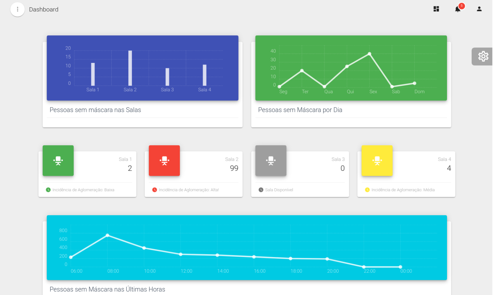

# grupo2-rep

# :crystal_ball: Equipe Tecnoria :crystal_ball:

## Desafio TechLab 
Devido a pandemia do COVID-19, as pessoas começaram a se sentir inseguras em ir trabalhar presencialmente. Pensando nisso, nos foi proposto um desafio onde teriamos com o auxílio de diversas tecnologias como a IA, fazer a detecção do uso ou não de máscara e de aglomerações, essa aplicação também emitiria alertas para ajudar na tomada de decisão quando fossem encontradas pessoas sem máscara ou aglomeradas.


## Pré-requisitos
Este projeto foi desenvolvido principalmente em Python, Vuejs, Vuetify e Node 


## Guia de Uso

### Passos para rodar o Office View:



1- Baixar e instalar o Docker Desktop

2- Baixar e instalar o Python

3- Baixar e instalar o VScode (O programa auxilia o programador com algumas requisições necessárias, de acordo com o que é aberto por ele)

4- Baixar o Zip do projeto completo.

5- Abrir o arquivo 'dockercompose.yml', que se encontra dentro da pasta 'Docker', com o intuito de alterar o caminho que se encontra no arquivo, para o caminho de seu desktop até a pasta 'Docker'

6- Abrir o VScode e alterar os caminhos para os da sua máquina:
  -database.py
  -vue
  
7- Abrir o cmd, caminhar até a pasta do docker, para rodar a deepo, phpmyadmin e node (comando: 'docker-compose up'). É normal da primeira vez uma longa duração.

8- Para criação de um banco de dados, dentro do VScode, descomente todas as funções 'create' e comentar as últimas 4 linhas(são parte da API que será rodado posteriormente) na pasta 'main.py'

9- Rodar o localhost do phpmyadmin, no navegador, entrar na conta com suas credenciais ('mysql', 'root', 'Senha que se encontra no dockercompose.yml'). Após isso, criar um banco de dados chamado 'techlab'

10- Depois de criar o banco techlab e verificar que as tabelas foram criadas nele, execute: ```docker-compose up -d``` para rodar todo o sistema em background.

11 - Em seguida, abra outro terminal no vscode ou cmd e execute: ```docker exec -it docker_deepo_1 bin/bash```, estando em root, no caminho que você indicou na deepo, que está no seu docker-compose.yml, caminhe até a sua home executando cd home

12- Ainda na home, você vai precisar instalar os pacotes necessários para executar o reconhecimento de máscara, desse modo, execute: ```pip install -r requirements.txt```

13- Para confirmamento de que a API esteja rodando, o programador irá abrir o site web para saber se está puxando salas, cameras ou criando gráficos com informações do banco de dados

### Rodar o reconhecimento de máscara

Estando no segundo terminal cmd que você abriu e executou o comando indicado no passo 11, executar o seguinte comando:

- ```python application/FaceRecognition.py```

Se tudo tiver corrido bem, vai aparecer no seu terminal que frames e rostos foram salvos e você poderá verificar isso consultando as tabelas: frames e faces do seu banco de dados

### Rodar o servidor

Para que as cameras e salas que você criou no seu banco de dados apareçam nas páginas: Gerenciar Salas e Gerenciar Cameras, a API precisa estar rodando, para isso execute o comando abaixo:

- ```python main.py```

### Página principal

- http://localhost:8080/

### Banco de Dados

- http://localhost:50060/

### Jupyter Notebook

- http://localhost:8899/tree

## Autores 
- [Alexandre Abib](https://github.com/AleAbib)
- [Douglas Marchione](https://github.com/Tiduzz)
- [Marcos Fernandes](https://github.com/Naandes)
- [Sigrid Rodrigues](https://github.com/sigrid-fr)
- [Thales Pimentel](https://github.com/TZuanazzi)
- [Valentina Garcia](https://github.com/valentinaagarcia)


## Atividades realizadas pelo grupo durante o desenvolvimento do projeto:

- Persona Canvas - Tecnoria: [https://miro.com/app/board/o9J_kkggMDE=/]

- Wireframes [https://drive.google.com/file/d/11MBYpoRDrK_ONsnJynYL0nRYbLZuZr99/view?usp=sharing]

- Requisitos [https://docs.google.com/spreadsheets/d/1TSAxa0hae9-7r8hR0XJwBLYWL5WGlrYovixkhZMJSPM/edit#gid=1089201472]

- Documento de Arquitetura de Software [https://docs.google.com/document/d/1kkXarixIvuwwKmQ3KMahRqBNqIS__cM2tMfaq6bFcmg/edit?usp=sharing]

- Elementos de Valor [https://docs.google.com/document/d/1DrmdxA3DtetOCPYQmTiQ44yxQIHuYrTMmAsLps6iXnQ/edit?usp=sharing]

- Diagrama .[https://viewer.diagrams.net/?highlight=0000ff&edit=_blank&layers=1&nav=1#G1IFdDzZG4HYUx64oPr8QIxyEsj9Yqxqni]

- Proposta de Valor e Segmentação de Cliente .[https://miro.com/welcomeonboard/46A0LCMZbfy12xvZEeXBD9DOVoQKzg7TMpqJibBgbphdjMgznfsLhrsxOw3Zk2BU]

- Canvas Modelo C .[https://miro.com/welcomeonboard/y5VnjN7ilwZhenN4tAqoRR6iVdf5ss1FgIqHOoc56TY3gCJcRkDcdCmfqT1lAtzd]

- Benchmark .[https://miro.com/welcomeonboard/YznEFhT20jooFgSq9ntfg3zQhrt3BCKNQTb2bGmoLwMlCTLbQ7Rv1uRhVYfSx3JO]

- Modelo do Produto Tecnológico .[https://miro.com/welcomeonboard/tCG5VoN9Ci24xMBnks9Kev0D34ezbko4AxkzRojZWBskAagk6xNhPbIhixp9qFXq]


